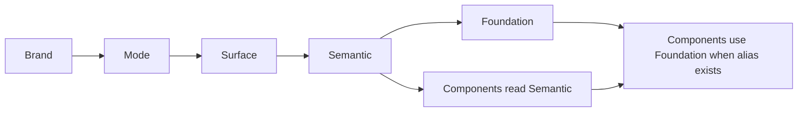

# Token Usage for Components and Figma (AI)

> **For AI Agents**: Use this document when building UI components or when reading design files (e.g. Figma via MCP) to understand which tokens are in use and how to apply them correctly.

---

## 1. Hierarchy in One Sentence

**Brand → Mode → Surface → Semantic → Foundation.**  
**Semantic** is the **exposed layer** (consumers use it). **Foundation** is a layer of **aliases** that reference Semantic tokens; it provides shorter, consumer-friendly names.

---

## 2. Rule for Components

When building or styling components:

- **Always use the Semantic layer** for styling. Semantic is the canonical, exposed token layer. All component styles should reference tokens under `semantic.*` (e.g. in CSS: `var(--semantic-color-...)`, in code: `tokens.semantic.color...`).
- **Use the Foundation layer only when** a suitable alias already exists and fits the use case (e.g. `foundation.bg.primary`, `foundation.txt.title`, `foundation.border.feedback.info.default`). Foundation tokens are shortcuts to Semantic; they do not replace Semantic as the source of truth.
- **Do not use** raw values or direct references to internal layers (mode, surface, brand) in components. Only Semantic (and, when appropriate, Foundation) should be used at the component level.

**Summary:** Components **always** use **Semantic** (the exposed layer); they **sometimes** use **Foundation** (aliases to Semantic) when an alias is available and appropriate.

---

## 3. How to Recognize Tokens (e.g. Figma / MCP)

When reading design files, token mappings, or code, you can identify which layer a token belongs to by its **name pattern**:

### Semantic tokens

- **Pattern:** `semantic.*` (e.g. `semantic.color.brand...`, `semantic.color.interface...`).
- **Examples (paths):**
  - `semantic.color.brand.branding.first.default.background`
  - `semantic.color.brand.ambient.contrast.deep.light.background`
  - `semantic.color.interface.feedback.info.default.default.background`
- **Where they appear:**
  - Source: `data/semantic/default.json`
  - Build output: `dist/json/{theme}-semantic.json`, `dist/semantic/`, CSS with `--semantic-*` variables
  - Figma/Code Connect: any mapping that uses the `semantic.*` path

### Foundation tokens

- **Pattern:** `foundation.*` (e.g. `foundation.bg.*`, `foundation.txt.*`, `foundation.border.*`).
- **Examples (paths):**
  - `foundation.bg.primary` → references `{semantic.color.brand.ambient.contrast.deep.light.background}`
  - `foundation.bg.brand.default` → references `{semantic.color.brand.branding.first.default.background}`
  - `foundation.bg.feedback.info.default` → references `{semantic.color.interface.feedback.info.default.default.background}`
- **Where they appear:**
  - Source: `data/foundation/{name}/default.json` (e.g. `data/foundation/engine/default.json`)
  - Build output: `dist/json/`, `dist/foundation/`, CSS with `--foundation-*` variables
  - Figma/Code Connect: any mapping that uses the `foundation.*` path

If you see a token name starting with `semantic.`, it is a Semantic token. If it starts with `foundation.`, it is a Foundation alias that ultimately resolves to a Semantic token.

---

## 4. Quick File Reference

| Layer      | Source (data)                    | Output (dist)                          |
|-----------|-----------------------------------|----------------------------------------|
| Semantic  | `data/semantic/default.json`      | Per-theme: `dist/json/*-semantic.json`, `dist/semantic/`, CSS `--semantic-*` |
| Foundation| `data/foundation/{engine\|sample}/default.json` | Per-brand: `dist/json/*-foundation.json`, `dist/foundation/`, CSS `--foundation-*` |

Foundation entries are aliases: each `$value` is a reference like `{semantic.color....}`. The build resolves these to the same values as the Semantic layer when needed (e.g. raw mode or CSS).

---

## 5. References in This Repo

- **Architecture and build:** [transformers/README.md](../../../transformers/README.md) (layer order, semantic vs foundation build).
- **Foundation spec:** [dynamic-themes/reference/FOUNDATION-SPEC.md](../../../dynamic-themes/reference/FOUNDATION-SPEC.md) (structure and config of foundations).
- **Token system overview:** [system-overview.md](system-overview.md).
- **Integration in apps:** [integration-guide.md](integration-guide.md).
