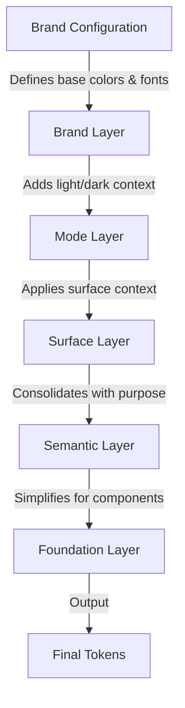

# Aplica Theme Engine - Designer Guide

> **A comprehensive guide for designers to understand and create themes using the Aplica Theme Engine**

## Table of Contents

1. [Introduction & Overview](#introduction--overview)
2. [Understanding Layers](#understanding-layers)
3. [Configuring Colors](#configuring-colors)
4. [Configuring Typography](#configuring-typography)
5. [Creating a New Theme](#creating-a-new-theme)
6. [Understanding the Output](#understanding-the-output)
7. [Best Practices](#best-practices)

---

## Introduction & Overview

### What is Aplica Theme Engine?

The Aplica Theme Engine is a powerful system for creating and managing design tokens that automatically generates complete theme files from simple configuration files. Instead of manually creating hundreds of color variations, typography tokens, and component styles, you define your brand colors and fonts once, and the engine handles the rest.

### Why Use Layers?

Think of the layer system like building a house:

- **Brand Layer** = Your foundation and materials (your colors and fonts)
- **Mode Layer** = The lighting system (light mode vs dark mode)
- **Surface Layer** = The room context (positive/negative surfaces)
- **Semantic Layer** = The organized blueprint (purpose-driven tokens)
- **Foundation Layer** = The finished rooms ready to use (simplified interface)

Each layer builds upon the previous one, transforming your base colors and fonts into a complete, usable design system. This approach ensures:

- **Consistency**: All themes follow the same structure
- **Maintainability**: Change one color, update everywhere
- **Flexibility**: Support multiple brands, modes, and contexts
- **Accessibility**: Automatic contrast checking and WCAG compliance

### Transformation Flow Overview

The Theme Engine processes your configuration through five layers:

```
Your Configuration → Brand → Mode → Surface → Semantic → Foundation → Final Output
```

Each layer adds context and meaning, transforming raw colors into semantic, purpose-driven tokens that developers can use directly in components.

---

## Understanding Layers

The Aplica Theme Engine uses a 5-layer architecture where each layer transforms and adds meaning to the previous layer's tokens.

### Layer Flow Diagram



### Layer 1: Brand Layer

**Purpose**: Defines your brand's visual identity - colors and typography.

**What you configure**: 
- Base brand colors (primary, secondary, tertiary)
- Action colors (buttons, links)
- Feedback colors (info, success, warning, error)
- Product colors (promo, cashback, premium)
- Font families and weights

**What gets generated**:
- Color palettes with 7 intensity levels (lowest → highest)
- Automatic color decomposition (19 levels per color)
- Typography tokens for all font families
- Border radius tokens

**Example**: If you define `joy_pink: '#E7398A'` as your primary brand color, the engine automatically creates:
- 7 intensity variations (from very light to very dark)
- Light and dark mode versions
- Proper contrast ratios for text on backgrounds
- All necessary color combinations

### Layer 2: Mode Layer

**Purpose**: Adapts colors for different visual contexts (light mode vs dark mode).

**What it does**:
- References brand colors in light/dark contexts
- Maintains consistent structure across modes
- Ensures proper contrast in each mode

**Key concept**: Both light and dark modes use the same structure, but reference different brand color variations. The engine automatically adjusts saturation and brightness for dark mode.

**Example**: 
- Light mode: Uses lighter, more saturated brand colors
- Dark mode: Uses darker, less saturated versions (15% less by default)

### Layer 3: Surface Layer

**Purpose**: Applies surface context (positive vs negative surfaces).

**What it does**:
- **Positive surface**: Default surface (like a white card on white background)
- **Negative surface**: Inverted surface (like a dark card on dark background)

**Inversion logic**: When using a negative surface, intensity levels are inverted:
- `lowest` becomes `highest`
- `lower` becomes `higher`
- `default` stays `default`
- `high` becomes `low`
- And so on...

**Why this matters**: This ensures proper contrast when you have cards, modals, or sections that need to stand out from the main background.

### Layer 4: Semantic Layer

**Purpose**: Consolidates all transformations into purpose-driven tokens.

**What it does**:
- Organizes tokens by their purpose (brand, interface, product, text)
- Resolves all references and transformations
- Creates a unified, semantic naming structure

**Structure**:
```
semantic
├── color
│   ├── brand (your brand colors)
│   ├── interface (buttons, links, feedback)
│   ├── product (promo, cashback, premium)
│   └── text (title, body, highlight, muted, label)
├── typography (fonts, sizes, weights, line heights)
├── dimension (spacing, sizing)
├── border (radius, width)
└── opacity
```

**Key benefit**: Developers can use tokens like `semantic.color.brand.primary.background` instead of remembering specific color codes.

### Layer 5: Foundation Layer

**Purpose**: Provides a simplified, component-ready interface.

**What it does**:
- Creates simplified token names (e.g., `bg.primary` instead of `semantic.color.brand.branding.first.default.background`)
- References semantic tokens (maintains single source of truth)
- Optimized for direct component usage

**Structure**:
```
foundation
├── bg (background colors)
├── border (border colors)
├── txt (text colors)
├── typography (references to semantic typography)
├── spacing (references to semantic spacing)
└── shadows (elevation levels)
```

**Key benefit**: Simplest possible API for components while maintaining full flexibility.

---

## Configuring Colors

Colors are the heart of your theme. The Theme Engine uses a structured approach to define and organize colors.

### Color Structure Overview

When configuring colors, you define them in three parts:

1. **Base Colors**: The actual color values (HEX codes)
2. **Color Mapping**: How colors map to semantic purposes
3. **Color Options**: How colors behave (contrast, accessibility)

### Base Color Definitions

In your configuration file, you define base colors with descriptive names:

```javascript
colors: {
  // Brand colors - your primary identity
  joy_pink: '#E7398A',
  joy_blue: '#38C2D0',
  joy_purple: '#8F58BD',
  
  // Action colors - interactive elements
  action_magenta: '#C40145',
  action_cyan: '#1872A6',
  link_pink: '#FF0F80',
  
  // Feedback colors - system status
  info_blue: '#A5E7D9',
  info_blue_dark: '#2B9E8C',
  success_green: '#86C46D',
  success_green_dark: '#3D8F2F',
  warning_orange: '#FDB750',
  warning_orange_dark: '#D98C00',
  danger_red: '#EE5A7E',
  danger_red_dark: '#C42850',
  
  // Product colors - business features
  promo_green: '#E3F6CC',
  promo_green_dark: '#AEE071',
  cashback_pink: '#FCD4DB',
  cashback_pink_dark: '#FE8095',
  premium_purple: '#ECE2E9',
  premium_purple_dark: '#B200AF'
}
```

### Brand Colors

Brand colors are your primary identity colors. You can define up to four brand colors:

- **first**: Primary brand color (most important)
- **second**: Secondary brand color
- **third**: Tertiary brand color
- **fourth**: Quaternary brand color (optional; extend schema/config when using N brand colors)

Each brand color automatically generates 7 intensity levels:

| Level | Description | Usage Example |
|-------|-------------|--------------|
| `lowest` | Lightest possible | Subtle backgrounds, hover states |
| `lower` | Very light | Soft borders, light backgrounds |
| `low` | Light | Secondary backgrounds |
| `default` | Brand default | Main brand elements, primary buttons |
| `high` | Dark | Text on light backgrounds |
| `higher` | Very dark | Emphasis, strong contrast |
| `highest` | Darkest possible | Maximum contrast, important text |

Each level also generates three properties:
- `background`: The color itself
- `txtOn`: Text color that works on this background (automatically calculated)
- `border`: Border color that works with this background

### Action Colors

Action colors define interactive elements:

- **primary**: Main call-to-action buttons
- **secondary**: Secondary buttons
- **link**: Text links

Each action color has three states:
- `normal`: Default state
- `action`: Hover/focus state
- `active`: Pressed/active state

### Feedback Colors

Feedback colors communicate system status. Each feedback type has two variants:

- **default**: Lighter, more subtle (for backgrounds, badges)
- **secondary**: More saturated, stronger (for emphasis, alerts)

Feedback types:
- **info**: Information, tips, help
- **success**: Confirmation, success messages
- **warning**: Warnings, attention needed
- **danger**: Errors, critical issues

### Product Colors

Product colors are business-specific:

- **promo**: Promotions, offers, discounts
- **cashback**: Cashback, rewards
- **premium**: Premium features, VIP, exclusive

Each product color also has `default` and `secondary` variants.

### Color Mapping

After defining base colors, you map them to semantic purposes:

```javascript
mapping: {
  brand: {
    first: 'joy_pink',      // Primary brand color
    second: 'joy_blue',     // Secondary brand color
    third: 'joy_purple'     // Tertiary brand color
  },
  interface: {
    function: {
      primary: 'action_magenta',
      secondary: 'action_cyan',
      link: 'link_pink'
    },
    feedback: {
      info_default: 'info_blue',
      info_secondary: 'info_blue_dark',
      success_default: 'success_green',
      success_secondary: 'success_green_dark',
      warning_default: 'warning_orange',
      warning_secondary: 'warning_orange_dark',
      danger_default: 'danger_red',
      danger_secondary: 'danger_red_dark'
    }
  },
  product: {
    promo_default: 'promo_green',
    promo_secondary: 'promo_green_dark',
    cashback_default: 'cashback_pink',
    cashback_secondary: 'cashback_pink_dark',
    premium_default: 'premium_purple',
    premium_secondary: 'premium_purple_dark'
  }
}
```

### Color Options

Control how colors behave with options:

```javascript
options: {
  // Text contrast strategy
  // 'high-contrast': Text is always black or white (maximum contrast)
  // 'brand-tint': Text uses closest palette color that passes WCAG (maintains brand tone)
  txtOnStrategy: 'brand-tint',
  
  // Dark mode saturation
  // 1.0 = same saturation as light mode
  // 0.85 = 15% less saturated (recommended, easier on eyes)
  // 0.7 = 30% less saturated (very muted)
  darkModeChroma: 0.85,
  
  // Accessibility level
  // 'AA' (default): WCAG AA standard (4.5:1 contrast ratio)
  // 'AAA': Enhanced accessibility (7:1 contrast ratio)
  accessibilityLevel: 'AAA'
}
```

**Text Contrast Strategy**:
- `high-contrast`: Always uses pure black or white for maximum readability
- `brand-tint`: Uses a tinted version of your brand color that meets contrast requirements (maintains brand personality)

**Dark Mode Chroma**: Controls how saturated colors are in dark mode. Lower values create more muted, easier-on-the-eyes dark themes.

**Accessibility Level**: 
- `AA`: Industry standard minimum (4.5:1 contrast ratio)
- `AAA`: Enhanced accessibility (7:1 contrast ratio) - better for readability

---

## Configuring Typography

Typography configuration defines your font families, weights, and how they're used throughout your theme.

### Font Families

You define four font family roles:

```javascript
typography: {
  fontFamilies: {
    main: 'Segoe UI',        // UI elements, buttons, labels
    content: 'Segoe UI',     // Body text, paragraphs
    display: 'Poppins',      // Headlines, titles, large text
    code: 'IBM Plex Mono'    // Code blocks, monospace text
  }
}
```

**Font Roles**:
- **main**: Primary UI font (buttons, labels, form inputs)
- **content**: Content font (body text, paragraphs, descriptions)
- **display**: Display font (headlines, titles, hero text)
- **code**: Monospace font (code blocks, technical content)

### Font Weights

Each font family requires 5 semantic weights. You must declare all 5 for each family:

```javascript
weights: {
  main: {
    light: { normal: 'Light', italic: 'Light Italic', numeric: 300 },
    regular: { normal: 'Regular', italic: 'Regular Italic', numeric: 400 },
    semibold: { normal: 'SemiBold', italic: 'SemiBold Italic', numeric: 600 },
    bold: { normal: 'Bold', italic: 'Bold Italic', numeric: 700 },
    black: { normal: 'Black', italic: 'Black Italic', numeric: 900 }
  },
  // ... repeat for content, display, code
}
```

**Semantic Weights**:
- **light** (300): Light text, subtle emphasis
- **regular** (400): Normal body text, default weight
- **semibold** (600): Medium emphasis, subheadings
- **bold** (700): Strong emphasis, headings
- **black** (900): Maximum emphasis, hero text

**Weight Properties**:
- `normal`: Figma/design tool name (e.g., "Bold")
- `italic`: Italic variant name (e.g., "Bold Italic")
- `numeric`: CSS numeric value (e.g., 700)

### Handling Fonts Without Exact Weights

Some fonts don't have all 5 semantic weights. In this case, you map available weights to semantic weights:

```javascript
display: {
  // Sansita doesn't have Light, so Regular maps to light
  light: { normal: 'Regular', italic: 'Regular Italic', numeric: 400 },
  regular: { normal: 'Regular', italic: 'Regular Italic', numeric: 400 },
  // Sansita doesn't have SemiBold, so Bold maps to semibold
  semibold: { normal: 'Bold', italic: 'Bold Italic', numeric: 700 },
  bold: { normal: 'ExtraBold', italic: 'ExtraBold Italic', numeric: 800 },
  black: { normal: 'Black', italic: 'Black Italic', numeric: 900 }
}
```

The system will use these mappings to generate the correct tokens while maintaining semantic meaning.

### Complete Typography Example

```javascript
typography: {
  fontFamilies: {
    main: 'Roboto',
    content: 'Roboto',
    display: 'Sansita',
    code: 'IBM Plex Mono'
  },
  weights: {
    main: {
      light: { normal: 'Light', italic: 'Light Italic', numeric: 300 },
      regular: { normal: 'Regular', italic: 'Regular Italic', numeric: 400 },
      semibold: { normal: 'SemiBold', italic: 'SemiBold Italic', numeric: 600 },
      bold: { normal: 'Bold', italic: 'Bold Italic', numeric: 700 },
      black: { normal: 'Black', italic: 'Black Italic', numeric: 900 }
    },
    content: {
      // Same as main...
    },
    display: {
      // Custom mapping for Sansita
      light: { normal: 'Regular', italic: 'Regular Italic', numeric: 400 },
      regular: { normal: 'Regular', italic: 'Regular Italic', numeric: 400 },
      semibold: { normal: 'Bold', italic: 'Bold Italic', numeric: 700 },
      bold: { normal: 'ExtraBold', italic: 'ExtraBold Italic', numeric: 800 },
      black: { normal: 'Black', italic: 'Black Italic', numeric: 900 }
    },
    code: {
      // Same structure...
    }
  }
}
```

---

## Creating a New Theme

Creating a new theme is straightforward. Follow these steps to create your own brand theme.

### Step 1: Copy the Template

Start by copying the base template:

```bash
cp dynamic-themes/configs/theme-engine.config.mjs dynamic-themes/configs/my-brand.config.mjs
```

The template (`theme-engine.config.mjs`) contains all the structure you need with example values.

### Step 2: Update Theme Name

Change the `name` property to your brand name:

```javascript
export default {
  name: 'my_brand',  // This will be the folder name in data/brand/
  // ...
}
```

### Step 3: Define Your Colors

Replace the example colors with your brand colors:

```javascript
colors: {
  // Your brand colors
  brand_primary: '#0066CC',
  brand_secondary: '#2E2E2E',
  brand_tertiary: '#666666',
  
  // Your action colors
  action_primary: '#0066CC',
  action_secondary: '#2E2E2E',
  action_link: '#0066CC',
  
  // Your feedback colors
  info_blue: '#0288D1',
  info_blue_dark: '#0356B0',
  success_green: '#00A838',
  success_green_dark: '#007A28',
  warning_orange: '#F28E01',
  warning_orange_dark: '#C47100',
  danger_red: '#E82727',
  danger_red_dark: '#B81C1C',
  
  // Your product colors
  promo_red: '#e91935',
  promo_red_dark: '#c41228',
  cashback_gold: '#ffcc00',
  cashback_gold_dark: '#d4a800',
  premium_purple: '#6e3ce4',
  premium_purple_dark: '#5424c9'
}
```

**Tips for choosing colors**:
- Use your brand's primary colors for brand colors
- Choose action colors that work well for buttons and links
- Use standard feedback colors (blue=info, green=success, orange=warning, red=danger)
- Product colors should be distinct and recognizable

### Step 4: Map Colors to Semantics

Connect your colors to their semantic purposes:

```javascript
mapping: {
  brand: {
    first: 'brand_primary',
    second: 'brand_secondary',
    third: 'brand_tertiary'
  },
  interface: {
    function: {
      primary: 'action_primary',
      secondary: 'action_secondary',
      link: 'action_link'
    },
    feedback: {
      info_default: 'info_blue',
      info_secondary: 'info_blue_dark',
      success_default: 'success_green',
      success_secondary: 'success_green_dark',
      warning_default: 'warning_orange',
      warning_secondary: 'warning_orange_dark',
      danger_default: 'danger_red',
      danger_secondary: 'danger_red_dark'
    }
  },
  product: {
    promo_default: 'promo_red',
    promo_secondary: 'promo_red_dark',
    cashback_default: 'cashback_gold',
    cashback_secondary: 'cashback_gold_dark',
    premium_default: 'premium_purple',
    premium_secondary: 'premium_purple_dark'
  }
}
```

### Step 5: Configure Typography

Set your font families and weights:

```javascript
typography: {
  fontFamilies: {
    main: 'Roboto Flex',
    content: 'Roboto Flex',
    display: 'Roboto Flex',
    code: 'Source Code Pro'
  },
  weights: {
    main: {
      light: { normal: 'Light', italic: 'Light Italic', numeric: 300 },
      regular: { normal: 'Regular', italic: 'Regular Italic', numeric: 400 },
      semibold: { normal: 'SemiBold', italic: 'SemiBold Italic', numeric: 600 },
      bold: { normal: 'Bold', italic: 'Bold Italic', numeric: 700 },
      black: { normal: 'Black', italic: 'Black Italic', numeric: 900 }
    },
    // ... repeat for content, display, code
  }
}
```

### Step 6: Set Options (Optional)

Customize behavior with options:

```javascript
options: {
  txtOnStrategy: 'brand-tint',      // or 'high-contrast'
  darkModeChroma: 0.85,            // 0.7 to 1.0
  accessibilityLevel: 'AA'          // or 'AAA'
}
```

### Step 7: Generate Your Theme

Run the theme generator:

```bash
npm run themes:generate
```

Or generate just your theme:

```bash
node dynamic-themes/scripts/generate-all-themes.mjs --config=my_brand
```

### Step 8: Build the Complete System

After generating themes, build the complete token system:

```bash
npm run build:themes
```

This will:
1. Generate all brand themes
2. Sync architecture files
3. Generate foundations
4. Build final output files

### Complete Example: Creating "Ocean Blue" Theme

Here's a complete example configuration:

```javascript
/**
 * Ocean Blue Theme Configuration
 * A calm, professional theme with ocean-inspired colors
 */

export default {
  name: 'ocean_blue',
  
  colors: {
    // Brand colors
    ocean_primary: '#0066CC',
    ocean_secondary: '#00A8E8',
    ocean_accent: '#003D7A',
    
    // Action colors
    action_primary: '#0066CC',
    action_secondary: '#00A8E8',
    action_link: '#0066CC',
    
    // Feedback colors
    info_blue: '#0288D1',
    info_blue_dark: '#0356B0',
    success_green: '#00A838',
    success_green_dark: '#007A28',
    warning_orange: '#F28E01',
    warning_orange_dark: '#C47100',
    danger_red: '#E82727',
    danger_red_dark: '#B81C1C',
    
    // Product colors
    promo_teal: '#00BCD4',
    promo_teal_dark: '#0097A7',
    cashback_gold: '#FFC107',
    cashback_gold_dark: '#FFA000',
    premium_navy: '#1976D2',
    premium_navy_dark: '#1565C0'
  },
  
  mapping: {
    brand: {
      first: 'ocean_primary',
      second: 'ocean_secondary',
      third: 'ocean_accent'
    },
    interface: {
      function: {
        primary: 'action_primary',
        secondary: 'action_secondary',
        link: 'action_link'
      },
      feedback: {
        info_default: 'info_blue',
        info_secondary: 'info_blue_dark',
        success_default: 'success_green',
        success_secondary: 'success_green_dark',
        warning_default: 'warning_orange',
        warning_secondary: 'warning_orange_dark',
        danger_default: 'danger_red',
        danger_secondary: 'danger_red_dark'
      }
    },
    product: {
      promo_default: 'promo_teal',
      promo_secondary: 'promo_teal_dark',
      cashback_default: 'cashback_gold',
      cashback_secondary: 'cashback_gold_dark',
      premium_default: 'premium_navy',
      premium_secondary: 'premium_navy_dark'
    }
  },
  
  options: {
    txtOnStrategy: 'brand-tint',
    darkModeChroma: 0.85,
    accessibilityLevel: 'AA'
  },
  
  typography: {
    fontFamilies: {
      main: 'Inter',
      content: 'Inter',
      display: 'Inter',
      code: 'Fira Code'
    },
    weights: {
      main: {
        light: { normal: 'Light', italic: 'Light Italic', numeric: 300 },
        regular: { normal: 'Regular', italic: 'Regular Italic', numeric: 400 },
        semibold: { normal: 'SemiBold', italic: 'SemiBold Italic', numeric: 600 },
        bold: { normal: 'Bold', italic: 'Bold Italic', numeric: 700 },
        black: { normal: 'Black', italic: 'Black Italic', numeric: 900 }
      },
      content: {
        light: { normal: 'Light', italic: 'Light Italic', numeric: 300 },
        regular: { normal: 'Regular', italic: 'Regular Italic', numeric: 400 },
        semibold: { normal: 'SemiBold', italic: 'SemiBold Italic', numeric: 600 },
        bold: { normal: 'Bold', italic: 'Bold Italic', numeric: 700 },
        black: { normal: 'Black', italic: 'Black Italic', numeric: 900 }
      },
      display: {
        light: { normal: 'Light', italic: 'Light Italic', numeric: 300 },
        regular: { normal: 'Regular', italic: 'Regular Italic', numeric: 400 },
        semibold: { normal: 'SemiBold', italic: 'SemiBold Italic', numeric: 600 },
        bold: { normal: 'Bold', italic: 'Bold Italic', numeric: 700 },
        black: { normal: 'Black', italic: 'Black Italic', numeric: 900 }
      },
      code: {
        light: { normal: 'Light', italic: 'Light Italic', numeric: 300 },
        regular: { normal: 'Regular', italic: 'Regular Italic', numeric: 400 },
        semibold: { normal: 'SemiBold', italic: 'SemiBold Italic', numeric: 600 },
        bold: { normal: 'Bold', italic: 'Bold Italic', numeric: 700 },
        black: { normal: 'Black', italic: 'Black Italic', numeric: 700 }
      }
    }
  }
};
```

After saving this file as `ocean-blue.config.mjs` and running the generator, you'll have a complete theme ready to use!

---

## Understanding the Output

After generating your theme, the Theme Engine creates multiple files and formats. Understanding what's generated helps you use your theme effectively.

### Generated Files Structure

When you generate a theme, files are created in `data/brand/{your-theme-name}/`:

```
data/brand/ocean_blue/
├── _primitive_theme.json    # Color primitives (19 levels per color)
├── _grayscale.json          # Fixed grayscale scale
├── _brand.json              # Semantic color mapping
├── _typography.json         # Typography tokens
├── _borders.json            # Border radius tokens
└── $meta.json               # Generation metadata
```

### File Purposes

**`_primitive_theme.json`**: 
- Contains the full color decomposition
- 19 intensity levels per color
- Used internally by the system
- Only needed if `includePrimitives: true` (default)

**`_grayscale.json`**:
- Fixed grayscale scale (doesn't change per theme)
- Used for neutral backgrounds and surfaces

**`_brand.json`**:
- Your brand's semantic color mapping
- Organized by purpose (brand, interface, product, text)
- Contains light and dark mode variations

**`_typography.json`**:
- All typography tokens
- Font families, sizes, weights, line heights
- Ready to use in components

**`_borders.json`**:
- Border radius tokens
- Consistent across all themes

### Build Output Formats

After building, tokens are available in multiple formats in the `dist/` directory:

```
dist/
├── json/                    # JSON format (nested structure)
│   ├── ocean_blue-light-positive.json
│   ├── ocean_blue-light-negative.json
│   ├── ocean_blue-dark-positive.json
│   └── ocean_blue-dark-negative.json
├── esm/                     # ES Modules (.mjs)
│   └── ocean_blue-*.mjs
├── js/                      # CommonJS (.cjs)
│   └── ocean_blue-*.cjs
└── css/                     # CSS Variables
    └── ocean_blue-*.css
```

### Using Generated Tokens

**In CSS**:
```css
/* Using CSS variables */
.button {
  background: var(--semantic-color-interface-function-primary-normal-background);
  color: var(--semantic-color-interface-function-primary-normal-txtOn);
}
```

**In JavaScript (ES Modules)**:
```javascript
import tokens from './dist/esm/ocean_blue-light-positive.mjs';

const buttonStyle = {
  backgroundColor: tokens.semantic.color.interface.function.primary.normal.background,
  color: tokens.semantic.color.interface.function.primary.normal.txtOn
};
```

**In JavaScript (CommonJS)**:
```javascript
const tokens = require('./dist/js/ocean_blue-light-positive.cjs');

const buttonStyle = {
  backgroundColor: tokens.semantic.color.interface.function.primary.normal.background,
  color: tokens.semantic.color.interface.function.primary.normal.txtOn
};
```

**In JSON**:
```json
{
  "semantic": {
    "color": {
      "interface": {
        "function": {
          "primary": {
            "normal": {
              "background": "#0066CC",
              "txtOn": "#FFFFFF"
            }
          }
        }
      }
    }
  }
}
```

### Theme Combinations

Each theme generates multiple combinations:

- `{brand}-light-positive`: Light mode, positive surface
- `{brand}-light-negative`: Light mode, negative surface
- `{brand}-dark-positive`: Dark mode, positive surface
- `{brand}-dark-negative`: Dark mode, negative surface

For example, `ocean_blue` generates:
- `ocean_blue-light-positive.json`
- `ocean_blue-light-negative.json`
- `ocean_blue-dark-positive.json`
- `ocean_blue-dark-negative.json`

### Foundation Tokens

Foundation tokens provide a simplified interface:

```javascript
// Instead of:
tokens.semantic.color.brand.branding.first.default.background

// Use:
tokens.foundation.bg.primary
```

Foundation tokens are available in:
- `dist/json/foundation/{foundation-name}/foundation.json`
- `dist/esm/foundation/{foundation-name}/foundation.mjs`
- `dist/js/foundation/{foundation-name}/foundation.cjs`
- `dist/css/foundation/{foundation-name}/foundation.css`

---

## Best Practices

Follow these guidelines to create effective, maintainable themes.

### Choosing Colors

**Brand Colors**:
- Choose 2-4 distinct brand colors that represent your brand
- Ensure colors work well together
- Consider how colors look in both light and dark modes
- Test colors for accessibility (use the accessibility level option)

**Action Colors**:
- Primary action should be your most important brand color
- Secondary action should provide clear distinction from primary
- Link color should be recognizable but not overpowering

**Feedback Colors**:
- Use standard associations (blue=info, green=success, orange=warning, red=danger)
- Ensure sufficient contrast for text readability
- Consider colorblind users (don't rely solely on color)

**Product Colors**:
- Choose distinct colors that users will recognize
- Ensure they don't conflict with feedback colors
- Consider cultural associations (e.g., gold for premium)

### Contrast and Accessibility

**Always Test Contrast**:
- Use the `accessibilityLevel` option to enforce WCAG compliance
- `AA` (4.5:1) is the minimum standard
- `AAA` (7:1) provides better readability

**Text on Backgrounds**:
- The engine automatically calculates `txtOn` colors
- Choose `high-contrast` for maximum readability
- Choose `brand-tint` to maintain brand personality

**Dark Mode Considerations**:
- Use `darkModeChroma: 0.85` (default) for comfortable viewing
- Lower values (0.7) create more muted, easier-on-eyes themes
- Higher values (1.0) maintain full saturation (may be too bright)

### Consistency Across Themes

**Naming Conventions**:
- Use consistent naming patterns across themes
- Follow the template structure
- Document any custom color purposes

**Color Relationships**:
- Maintain similar relationships between colors across themes
- If one theme uses blue for primary, consider using blue tones in other themes
- Keep feedback colors consistent (blue=info, green=success, etc.)

**Typography Consistency**:
- Use the same font families across related themes when possible
- Maintain consistent weight mappings
- Document any special font weight mappings

### Naming Best Practices

**Color Names**:
- Use descriptive names: `ocean_blue` not `blue1`
- Include context: `action_primary` not `button_color`
- Be consistent: `info_blue` and `info_blue_dark` (not `info_blue_light`)

**Theme Names**:
- Use lowercase with underscores: `ocean_blue` not `OceanBlue`
- Be descriptive: `corporate_professional` not `theme1`
- Avoid special characters

### Testing Your Theme

**Before Finalizing**:
1. Generate the theme and review all generated files
2. Test in both light and dark modes
3. Test with positive and negative surfaces
4. Verify all colors meet accessibility requirements
5. Check that typography renders correctly
6. Test in actual components if possible

**Common Issues**:
- **Colors too similar**: Adjust saturation or brightness
- **Poor contrast**: Use `high-contrast` strategy or adjust colors
- **Dark mode too bright**: Lower `darkModeChroma` value
- **Missing font weights**: Check font family supports all weights

### Maintenance

**Version Control**:
- Keep configuration files in version control
- Document any manual overrides or special cases
- Tag releases with theme versions

**Updates**:
- When updating colors, regenerate the entire theme
- Test all combinations after updates
- Update documentation if structure changes

**Collaboration**:
- Share configuration files with team members
- Document color choices and rationale
- Maintain a style guide referencing your themes

---

## Summary

The Aplica Theme Engine transforms simple color and font configurations into complete, production-ready design systems. By understanding the layer architecture and following best practices, you can create consistent, accessible themes that scale across your entire design system.

**Key Takeaways**:
- Define colors once, use everywhere
- Layers add context and meaning automatically
- Typography configuration ensures consistency
- Multiple output formats support any use case
- Accessibility is built-in, not an afterthought

**Next Steps**:
- Review existing theme configurations for examples
- Start with the template and customize gradually
- Test thoroughly before deploying
- Iterate based on component usage feedback

For technical details and advanced usage, refer to the [Core Architecture](./#03%20Theme%20Engine%20-%20Core%20Architecture.md) and [Technical Reference](./#05%20Theme%20Engine%20-%20Technical%20Reference.md) documentation.
