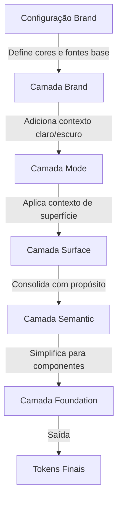

# Aplica Theme Engine - Guia do Designer

> **Um guia completo para designers entenderem e criarem temas usando o Aplica Theme Engine**

## Índice

1. [Introdução e Visão Geral](#introdução-e-visão-geral)
2. [Entendendo as Camadas](#entendendo-as-camadas)
3. [Configurando Cores](#configurando-cores)
4. [Configurando Tipografia](#configurando-tipografia)
5. [Criando um Novo Tema](#criando-um-novo-tema)
6. [Entendendo a Saída](#entendendo-a-saída)
7. [Boas Práticas](#boas-práticas)

---

## Introdução e Visão Geral

### O que é o Aplica Theme Engine?

O Aplica Theme Engine é um sistema poderoso para criar e gerenciar design tokens que gera automaticamente arquivos de tema completos a partir de arquivos de configuração simples. Em vez de criar manualmente centenas de variações de cores, tokens de tipografia e estilos de componentes, você define suas cores e fontes da marca uma vez, e o engine cuida do resto.

### Por que Usar Camadas?

Pense no sistema de camadas como construir uma casa:

- **Camada Brand** = Sua fundação e materiais (suas cores e fontes)
- **Camada Mode** = O sistema de iluminação (modo claro vs modo escuro)
- **Camada Surface** = O contexto do ambiente (superfícies positivas/negativas)
- **Camada Semantic** = O projeto organizado (tokens orientados por propósito)
- **Camada Foundation** = Os cômodos prontos para usar (interface simplificada)

Cada camada constrói sobre a anterior, transformando suas cores e fontes base em um sistema de design completo e utilizável. Essa abordagem garante:

- **Consistência**: Todos os temas seguem a mesma estrutura
- **Manutenibilidade**: Mude uma cor, atualize em todos os lugares
- **Flexibilidade**: Suporta múltiplas marcas, modos e contextos
- **Acessibilidade**: Verificação automática de contraste e conformidade WCAG

### Visão Geral do Fluxo de Transformação

O Theme Engine processa sua configuração através de cinco camadas:

```
Sua Configuração → Brand → Mode → Surface → Semantic → Foundation → Saída Final
```

Cada camada adiciona contexto e significado, transformando cores brutas em tokens semânticos orientados por propósito que desenvolvedores podem usar diretamente em componentes.

---

## Entendendo as Camadas

O Aplica Theme Engine usa uma arquitetura de 5 camadas onde cada camada transforma e adiciona significado aos tokens da camada anterior.

### Diagrama de Fluxo das Camadas



### Camada 1: Brand Layer

**Propósito**: Define a identidade visual da sua marca - cores e tipografia.

**O que você configura**: 
- Cores base da marca (primária, secundária, terciária)
- Cores de ação (botões, links)
- Cores de feedback (info, sucesso, aviso, erro)
- Cores de produto (promo, cashback, premium)
- Famílias de fontes e pesos

**O que é gerado**:
- Paletas de cores com 7 níveis de intensidade (lowest → highest)
- Decomposição automática de cores (19 níveis por cor)
- Tokens de tipografia para todas as famílias de fontes
- Tokens de raio de borda

**Exemplo**: Se você define `joy_pink: '#E7398A'` como sua cor primária da marca, o engine cria automaticamente:
- 7 variações de intensidade (do mais claro ao mais escuro)
- Versões para modo claro e escuro
- Proporções de contraste adequadas para texto em fundos
- Todas as combinações de cores necessárias

### Camada 2: Mode Layer

**Propósito**: Adapta cores para diferentes contextos visuais (modo claro vs modo escuro).

**O que faz**:
- Referencia cores da marca em contextos claro/escuro
- Mantém estrutura consistente entre modos
- Garante contraste adequado em cada modo

**Conceito chave**: Ambos os modos claro e escuro usam a mesma estrutura, mas referenciam diferentes variações de cores da marca. O engine ajusta automaticamente saturação e brilho para o modo escuro.

**Exemplo**: 
- Modo claro: Usa cores da marca mais claras e saturadas
- Modo escuro: Usa versões mais escuras e menos saturadas (15% menos por padrão)

### Camada 3: Surface Layer

**Propósito**: Aplica contexto de superfície (superfícies positivas vs negativas).

**O que faz**:
- **Superfície positiva**: Superfície padrão (como um card branco em fundo branco)
- **Superfície negativa**: Superfície invertida (como um card escuro em fundo escuro)

**Lógica de inversão**: Ao usar uma superfície negativa, os níveis de intensidade são invertidos:
- `lowest` se torna `highest`
- `lower` se torna `higher`
- `default` permanece `default`
- `high` se torna `low`
- E assim por diante...

**Por que isso importa**: Isso garante contraste adequado quando você tem cards, modais ou seções que precisam se destacar do fundo principal.

### Camada 4: Semantic Layer

**Propósito**: Consolida todas as transformações em tokens orientados por propósito.

**O que faz**:
- Organiza tokens por seu propósito (marca, interface, produto, texto)
- Resolve todas as referências e transformações
- Cria uma estrutura de nomenclatura semântica unificada

**Estrutura**:
```
semantic
├── color
│   ├── brand (suas cores da marca)
│   ├── interface (botões, links, feedback)
│   ├── product (promo, cashback, premium)
│   └── text (título, corpo, destaque, muted, label)
├── typography (fontes, tamanhos, pesos, alturas de linha)
├── dimension (espaçamento, dimensionamento)
├── border (raio, largura)
└── opacity
```

**Benefício chave**: Desenvolvedores podem usar tokens como `semantic.color.brand.primary.background` em vez de lembrar códigos de cores específicos.

### Camada 5: Foundation Layer

**Propósito**: Fornece uma interface simplificada, pronta para componentes.

**O que faz**:
- Cria nomes de tokens simplificados (ex: `bg.primary` em vez de `semantic.color.brand.branding.first.default.background`)
- Referencia tokens semânticos (mantém fonte única da verdade)
- Otimizado para uso direto em componentes

**Estrutura**:
```
foundation
├── bg (cores de fundo)
├── border (cores de borda)
├── txt (cores de texto)
├── typography (referências à tipografia semântica)
├── spacing (referências ao espaçamento semântico)
└── shadows (níveis de elevação)
```

**Benefício chave**: API mais simples possível para componentes mantendo total flexibilidade.

---

## Configurando Cores

As cores são o coração do seu tema. O Theme Engine usa uma abordagem estruturada para definir e organizar cores.

### Visão Geral da Estrutura de Cores

Ao configurar cores, você as define em três partes:

1. **Cores Base**: Os valores de cor reais (códigos HEX)
2. **Mapeamento de Cores**: Como as cores mapeiam para propósitos semânticos
3. **Opções de Cores**: Como as cores se comportam (contraste, acessibilidade)

### Definições de Cores Base

No seu arquivo de configuração, você define cores base com nomes descritivos:

```javascript
colors: {
  // Cores da marca - sua identidade primária
  joy_pink: '#E7398A',
  joy_blue: '#38C2D0',
  joy_purple: '#8F58BD',
  
  // Cores de ação - elementos interativos
  action_magenta: '#C40145',
  action_cyan: '#1872A6',
  link_pink: '#FF0F80',
  
  // Cores de feedback - status do sistema
  info_blue: '#A5E7D9',
  info_blue_dark: '#2B9E8C',
  success_green: '#86C46D',
  success_green_dark: '#3D8F2F',
  warning_orange: '#FDB750',
  warning_orange_dark: '#D98C00',
  danger_red: '#EE5A7E',
  danger_red_dark: '#C42850',
  
  // Cores de produto - recursos de negócio
  promo_green: '#E3F6CC',
  promo_green_dark: '#AEE071',
  cashback_pink: '#FCD4DB',
  cashback_pink_dark: '#FE8095',
  premium_purple: '#ECE2E9',
  premium_purple_dark: '#B200AF'
}
```

### Cores da Marca

As cores da marca são suas cores de identidade primária. Você pode definir até quatro cores da marca:

- **first**: Cor primária da marca (mais importante)
- **second**: Cor secundária da marca
- **third**: Cor terciária da marca
- **fourth**: Cor quaternária da marca (opcional; estender schema/config ao usar N cores de marca)

Cada cor da marca gera automaticamente 7 níveis de intensidade:

| Nível | Descrição | Exemplo de Uso |
|-------|-----------|----------------|
| `lowest` | Mais claro possível | Fundos sutis, estados de hover |
| `lower` | Muito claro | Bordas suaves, fundos claros |
| `low` | Claro | Fundos secundários |
| `default` | Padrão da marca | Elementos principais da marca, botões primários |
| `high` | Escuro | Texto em fundos claros |
| `higher` | Muito escuro | Ênfase, contraste forte |
| `highest` | Mais escuro possível | Contraste máximo, texto importante |

Cada nível também gera três propriedades:
- `background`: A cor em si
- `txtOn`: Cor do texto que funciona neste fundo (calculada automaticamente)
- `border`: Cor da borda que funciona com este fundo

### Cores de Ação

As cores de ação definem elementos interativos:

- **primary**: Botões principais de call-to-action
- **secondary**: Botões secundários
- **link**: Links de texto

Cada cor de ação tem três estados:
- `normal`: Estado padrão
- `action`: Estado de hover/focus
- `active`: Estado pressionado/ativo

### Cores de Feedback

As cores de feedback comunicam o status do sistema. Cada tipo de feedback tem duas variantes:

- **default**: Mais clara, mais sutil (para fundos, badges)
- **secondary**: Mais saturada, mais forte (para ênfase, alertas)

Tipos de feedback:
- **info**: Informação, dicas, ajuda
- **success**: Confirmação, mensagens de sucesso
- **warning**: Avisos, atenção necessária
- **danger**: Erros, problemas críticos

### Cores de Produto

As cores de produto são específicas do negócio:

- **promo**: Promoções, ofertas, descontos
- **cashback**: Cashback, recompensas
- **premium**: Recursos premium, VIP, exclusivo

Cada cor de produto também tem variantes `default` e `secondary`.

### Mapeamento de Cores

Após definir cores base, você as mapeia para propósitos semânticos:

```javascript
mapping: {
  brand: {
    first: 'joy_pink',      // Cor primária da marca
    second: 'joy_blue',     // Cor secundária da marca
    third: 'joy_purple'     // Cor terciária da marca
  },
  interface: {
    function: {
      primary: 'action_magenta',
      secondary: 'action_cyan',
      link: 'link_pink'
    },
    feedback: {
      info_default: 'info_blue',
      info_secondary: 'info_blue_dark',
      success_default: 'success_green',
      success_secondary: 'success_green_dark',
      warning_default: 'warning_orange',
      warning_secondary: 'warning_orange_dark',
      danger_default: 'danger_red',
      danger_secondary: 'danger_red_dark'
    }
  },
  product: {
    promo_default: 'promo_green',
    promo_secondary: 'promo_green_dark',
    cashback_default: 'cashback_pink',
    cashback_secondary: 'cashback_pink_dark',
    premium_default: 'premium_purple',
    premium_secondary: 'premium_purple_dark'
  }
}
```

### Opções de Cores

Controle como as cores se comportam com opções:

```javascript
options: {
  // Estratégia de contraste de texto
  // 'high-contrast': Texto é sempre preto ou branco (máximo contraste)
  // 'brand-tint': Texto usa cor mais próxima da paleta que passa WCAG (mantém tom da marca)
  txtOnStrategy: 'brand-tint',
  
  // Saturação do modo escuro
  // 1.0 = mesma saturação do modo claro
  // 0.85 = 15% menos saturado (recomendado, mais fácil para os olhos)
  // 0.7 = 30% menos saturado (muito suave)
  darkModeChroma: 0.85,
  
  // Nível de acessibilidade
  // 'AA' (padrão): Padrão WCAG AA (proporção de contraste 4.5:1)
  // 'AAA': Acessibilidade aprimorada (proporção de contraste 7:1)
  accessibilityLevel: 'AAA'
}
```

**Estratégia de Contraste de Texto**:
- `high-contrast`: Sempre usa preto ou branco puro para máxima legibilidade
- `brand-tint`: Usa uma versão matizada da sua cor da marca que atende aos requisitos de contraste (mantém personalidade da marca)

**Chroma do Modo Escuro**: Controla quão saturadas as cores são no modo escuro. Valores mais baixos criam temas escuros mais suaves e fáceis para os olhos.

**Nível de Acessibilidade**: 
- `AA`: Padrão mínimo da indústria (proporção de contraste 4.5:1)
- `AAA`: Acessibilidade aprimorada (proporção de contraste 7:1) - melhor para legibilidade

---

## Configurando Tipografia

A configuração de tipografia define suas famílias de fontes, pesos e como elas são usadas em todo o seu tema.

### Famílias de Fontes

Você define quatro papéis de família de fontes:

```javascript
typography: {
  fontFamilies: {
    main: 'Segoe UI',        // Elementos de UI, botões, labels
    content: 'Segoe UI',     // Texto do corpo, parágrafos
    display: 'Poppins',      // Manchetes, títulos, texto grande
    code: 'IBM Plex Mono'    // Blocos de código, texto monoespaçado
  }
}
```

**Papéis de Fonte**:
- **main**: Fonte primária de UI (botões, labels, inputs de formulário)
- **content**: Fonte de conteúdo (texto do corpo, parágrafos, descrições)
- **display**: Fonte de exibição (manchetes, títulos, texto hero)
- **code**: Fonte monoespaçada (blocos de código, conteúdo técnico)

### Pesos de Fonte

Cada família de fontes requer 5 pesos semânticos. Você deve declarar todos os 5 para cada família:

```javascript
weights: {
  main: {
    light: { normal: 'Light', italic: 'Light Italic', numeric: 300 },
    regular: { normal: 'Regular', italic: 'Regular Italic', numeric: 400 },
    semibold: { normal: 'SemiBold', italic: 'SemiBold Italic', numeric: 600 },
    bold: { normal: 'Bold', italic: 'Bold Italic', numeric: 700 },
    black: { normal: 'Black', italic: 'Black Italic', numeric: 900 }
  },
  // ... repetir para content, display, code
}
```

**Pesos Semânticos**:
- **light** (300): Texto claro, ênfase sutil
- **regular** (400): Texto normal do corpo, peso padrão
- **semibold** (600): Ênfase média, subtítulos
- **bold** (700): Ênfase forte, títulos
- **black** (900): Ênfase máxima, texto hero

**Propriedades de Peso**:
- `normal`: Nome do Figma/ferramenta de design (ex: "Bold")
- `italic`: Nome da variante itálica (ex: "Bold Italic")
- `numeric`: Valor numérico CSS (ex: 700)

### Lidando com Fontes Sem Pesos Exatos

Algumas fontes não têm todos os 5 pesos semânticos. Nesse caso, você mapeia pesos disponíveis para pesos semânticos:

```javascript
display: {
  // Sansita não tem Light, então Regular mapeia para light
  light: { normal: 'Regular', italic: 'Regular Italic', numeric: 400 },
  regular: { normal: 'Regular', italic: 'Regular Italic', numeric: 400 },
  // Sansita não tem SemiBold, então Bold mapeia para semibold
  semibold: { normal: 'Bold', italic: 'Bold Italic', numeric: 700 },
  bold: { normal: 'ExtraBold', italic: 'ExtraBold Italic', numeric: 800 },
  black: { normal: 'Black', italic: 'Black Italic', numeric: 900 }
}
```

O sistema usará esses mapeamentos para gerar os tokens corretos mantendo o significado semântico.

### Exemplo Completo de Tipografia

```javascript
typography: {
  fontFamilies: {
    main: 'Roboto',
    content: 'Roboto',
    display: 'Sansita',
    code: 'IBM Plex Mono'
  },
  weights: {
    main: {
      light: { normal: 'Light', italic: 'Light Italic', numeric: 300 },
      regular: { normal: 'Regular', italic: 'Regular Italic', numeric: 400 },
      semibold: { normal: 'SemiBold', italic: 'SemiBold Italic', numeric: 600 },
      bold: { normal: 'Bold', italic: 'Bold Italic', numeric: 700 },
      black: { normal: 'Black', italic: 'Black Italic', numeric: 900 }
    },
    content: {
      // Mesmo que main...
    },
    display: {
      // Mapeamento customizado para Sansita
      light: { normal: 'Regular', italic: 'Regular Italic', numeric: 400 },
      regular: { normal: 'Regular', italic: 'Regular Italic', numeric: 400 },
      semibold: { normal: 'Bold', italic: 'Bold Italic', numeric: 700 },
      bold: { normal: 'ExtraBold', italic: 'ExtraBold Italic', numeric: 800 },
      black: { normal: 'Black', italic: 'Black Italic', numeric: 900 }
    },
    code: {
      // Mesma estrutura...
    }
  }
}
```

---

## Criando um Novo Tema

Criar um novo tema é simples. Siga estes passos para criar seu próprio tema de marca.

### Passo 1: Copiar o Template

Comece copiando o template base:

```bash
cp dynamic-themes/configs/theme-engine.config.mjs dynamic-themes/configs/my-brand.config.mjs
```

O template (`theme-engine.config.mjs`) contém toda a estrutura que você precisa com valores de exemplo.

### Passo 2: Atualizar o Nome do Tema

Altere a propriedade `name` para o nome da sua marca:

```javascript
export default {
  name: 'my_brand',  // Este será o nome da pasta em data/brand/
  // ...
}
```

### Passo 3: Definir Suas Cores

Substitua as cores de exemplo pelas cores da sua marca:

```javascript
colors: {
  // Suas cores da marca
  brand_primary: '#0066CC',
  brand_secondary: '#2E2E2E',
  brand_tertiary: '#666666',
  
  // Suas cores de ação
  action_primary: '#0066CC',
  action_secondary: '#2E2E2E',
  action_link: '#0066CC',
  
  // Suas cores de feedback
  info_blue: '#0288D1',
  info_blue_dark: '#0356B0',
  success_green: '#00A838',
  success_green_dark: '#007A28',
  warning_orange: '#F28E01',
  warning_orange_dark: '#C47100',
  danger_red: '#E82727',
  danger_red_dark: '#B81C1C',
  
  // Suas cores de produto
  promo_red: '#e91935',
  promo_red_dark: '#c41228',
  cashback_gold: '#ffcc00',
  cashback_gold_dark: '#d4a800',
  premium_purple: '#6e3ce4',
  premium_purple_dark: '#5424c9'
}
```

**Dicas para escolher cores**:
- Use as cores primárias da sua marca para cores da marca
- Escolha cores de ação que funcionem bem para botões e links
- Use cores de feedback padrão (azul=info, verde=sucesso, laranja=aviso, vermelho=perigo)
- Cores de produto devem ser distintas e reconhecíveis

### Passo 4: Mapear Cores para Semântica

Conecte suas cores aos seus propósitos semânticos:

```javascript
mapping: {
  brand: {
    first: 'brand_primary',
    second: 'brand_secondary',
    third: 'brand_tertiary'
  },
  interface: {
    function: {
      primary: 'action_primary',
      secondary: 'action_secondary',
      link: 'action_link'
    },
    feedback: {
      info_default: 'info_blue',
      info_secondary: 'info_blue_dark',
      success_default: 'success_green',
      success_secondary: 'success_green_dark',
      warning_default: 'warning_orange',
      warning_secondary: 'warning_orange_dark',
      danger_default: 'danger_red',
      danger_secondary: 'danger_red_dark'
    }
  },
  product: {
    promo_default: 'promo_red',
    promo_secondary: 'promo_red_dark',
    cashback_default: 'cashback_gold',
    cashback_secondary: 'cashback_gold_dark',
    premium_default: 'premium_purple',
    premium_secondary: 'premium_purple_dark'
  }
}
```

### Passo 5: Configurar Tipografia

Defina suas famílias de fontes e pesos:

```javascript
typography: {
  fontFamilies: {
    main: 'Roboto Flex',
    content: 'Roboto Flex',
    display: 'Roboto Flex',
    code: 'Source Code Pro'
  },
  weights: {
    main: {
      light: { normal: 'Light', italic: 'Light Italic', numeric: 300 },
      regular: { normal: 'Regular', italic: 'Regular Italic', numeric: 400 },
      semibold: { normal: 'SemiBold', italic: 'SemiBold Italic', numeric: 600 },
      bold: { normal: 'Bold', italic: 'Bold Italic', numeric: 700 },
      black: { normal: 'Black', italic: 'Black Italic', numeric: 900 }
    },
    // ... repetir para content, display, code
  }
}
```

### Passo 6: Definir Opções (Opcional)

Personalize o comportamento com opções:

```javascript
options: {
  txtOnStrategy: 'brand-tint',      // ou 'high-contrast'
  darkModeChroma: 0.85,            // 0.7 a 1.0
  accessibilityLevel: 'AA'          // ou 'AAA'
}
```

### Passo 7: Gerar Seu Tema

Execute o gerador de temas:

```bash
npm run themes:generate
```

Ou gere apenas seu tema:

```bash
node dynamic-themes/scripts/generate-all-themes.mjs --config=my_brand
```

### Passo 8: Construir o Sistema Completo

Após gerar temas, construa o sistema completo de tokens:

```bash
npm run build:themes
```

Isso irá:
1. Gerar todos os temas de marca
2. Sincronizar arquivos de arquitetura
3. Gerar foundations
4. Construir arquivos de saída finais

### Exemplo Completo: Criando o Tema "Ocean Blue"

Aqui está um exemplo completo de configuração:

```javascript
/**
 * Configuração do Tema Ocean Blue
 * Um tema calmo e profissional com cores inspiradas no oceano
 */

export default {
  name: 'ocean_blue',
  
  colors: {
    // Cores da marca
    ocean_primary: '#0066CC',
    ocean_secondary: '#00A8E8',
    ocean_accent: '#003D7A',
    
    // Cores de ação
    action_primary: '#0066CC',
    action_secondary: '#00A8E8',
    action_link: '#0066CC',
    
    // Cores de feedback
    info_blue: '#0288D1',
    info_blue_dark: '#0356B0',
    success_green: '#00A838',
    success_green_dark: '#007A28',
    warning_orange: '#F28E01',
    warning_orange_dark: '#C47100',
    danger_red: '#E82727',
    danger_red_dark: '#B81C1C',
    
    // Cores de produto
    promo_teal: '#00BCD4',
    promo_teal_dark: '#0097A7',
    cashback_gold: '#FFC107',
    cashback_gold_dark: '#FFA000',
    premium_navy: '#1976D2',
    premium_navy_dark: '#1565C0'
  },
  
  mapping: {
    brand: {
      first: 'ocean_primary',
      second: 'ocean_secondary',
      third: 'ocean_accent'
    },
    interface: {
      function: {
        primary: 'action_primary',
        secondary: 'action_secondary',
        link: 'action_link'
      },
      feedback: {
        info_default: 'info_blue',
        info_secondary: 'info_blue_dark',
        success_default: 'success_green',
        success_secondary: 'success_green_dark',
        warning_default: 'warning_orange',
        warning_secondary: 'warning_orange_dark',
        danger_default: 'danger_red',
        danger_secondary: 'danger_red_dark'
      }
    },
    product: {
      promo_default: 'promo_teal',
      promo_secondary: 'promo_teal_dark',
      cashback_default: 'cashback_gold',
      cashback_secondary: 'cashback_gold_dark',
      premium_default: 'premium_navy',
      premium_secondary: 'premium_navy_dark'
    }
  },
  
  options: {
    txtOnStrategy: 'brand-tint',
    darkModeChroma: 0.85,
    accessibilityLevel: 'AA'
  },
  
  typography: {
    fontFamilies: {
      main: 'Inter',
      content: 'Inter',
      display: 'Inter',
      code: 'Fira Code'
    },
    weights: {
      main: {
        light: { normal: 'Light', italic: 'Light Italic', numeric: 300 },
        regular: { normal: 'Regular', italic: 'Regular Italic', numeric: 400 },
        semibold: { normal: 'SemiBold', italic: 'SemiBold Italic', numeric: 600 },
        bold: { normal: 'Bold', italic: 'Bold Italic', numeric: 700 },
        black: { normal: 'Black', italic: 'Black Italic', numeric: 900 }
      },
      content: {
        light: { normal: 'Light', italic: 'Light Italic', numeric: 300 },
        regular: { normal: 'Regular', italic: 'Regular Italic', numeric: 400 },
        semibold: { normal: 'SemiBold', italic: 'SemiBold Italic', numeric: 600 },
        bold: { normal: 'Bold', italic: 'Bold Italic', numeric: 700 },
        black: { normal: 'Black', italic: 'Black Italic', numeric: 900 }
      },
      display: {
        light: { normal: 'Light', italic: 'Light Italic', numeric: 300 },
        regular: { normal: 'Regular', italic: 'Regular Italic', numeric: 400 },
        semibold: { normal: 'SemiBold', italic: 'SemiBold Italic', numeric: 600 },
        bold: { normal: 'Bold', italic: 'Bold Italic', numeric: 700 },
        black: { normal: 'Black', italic: 'Black Italic', numeric: 900 }
      },
      code: {
        light: { normal: 'Light', italic: 'Light Italic', numeric: 300 },
        regular: { normal: 'Regular', italic: 'Regular Italic', numeric: 400 },
        semibold: { normal: 'SemiBold', italic: 'SemiBold Italic', numeric: 600 },
        bold: { normal: 'Bold', italic: 'Bold Italic', numeric: 700 },
        black: { normal: 'Black', italic: 'Black Italic', numeric: 700 }
      }
    }
  }
};
```

Após salvar este arquivo como `ocean-blue.config.mjs` e executar o gerador, você terá um tema completo pronto para usar!

---

## Entendendo a Saída

Após gerar seu tema, o Theme Engine cria múltiplos arquivos e formatos. Entender o que é gerado ajuda você a usar seu tema efetivamente.

### Estrutura de Arquivos Gerados

Quando você gera um tema, arquivos são criados em `data/brand/{nome-do-seu-tema}/`:

```
data/brand/ocean_blue/
├── _primitive_theme.json    # Primitivas de cor (19 níveis por cor)
├── _grayscale.json          # Escala de cinza fixa
├── _brand.json              # Mapeamento semântico de cores
├── _typography.json         # Tokens de tipografia
├── _borders.json            # Tokens de raio de borda
└── $meta.json               # Metadados de geração
```

### Propósitos dos Arquivos

**`_primitive_theme.json`**: 
- Contém a decomposição completa de cores
- 19 níveis de intensidade por cor
- Usado internamente pelo sistema
- Apenas necessário se `includePrimitives: true` (padrão)

**`_grayscale.json`**:
- Escala de cinza fixa (não muda por tema)
- Usado para fundos e superfícies neutras

**`_brand.json`**:
- Mapeamento semântico de cores da sua marca
- Organizado por propósito (marca, interface, produto, texto)
- Contém variações de modo claro e escuro

**`_typography.json`**:
- Todos os tokens de tipografia
- Famílias de fontes, tamanhos, pesos, alturas de linha
- Pronto para usar em componentes

**`_borders.json`**:
- Tokens de raio de borda
- Consistente em todos os temas

### Formatos de Saída do Build

Após construir, os tokens estão disponíveis em múltiplos formatos no diretório `dist/`:

```
dist/
├── json/                    # Formato JSON (estrutura aninhada)
│   ├── ocean_blue-light-positive.json
│   ├── ocean_blue-light-negative.json
│   ├── ocean_blue-dark-positive.json
│   └── ocean_blue-dark-negative.json
├── esm/                     # Módulos ES (.mjs)
│   └── ocean_blue-*.mjs
├── js/                      # CommonJS (.cjs)
│   └── ocean_blue-*.cjs
└── css/                     # Variáveis CSS
    └── ocean_blue-*.css
```

### Usando Tokens Gerados

**Em CSS**:
```css
/* Usando variáveis CSS */
.button {
  background: var(--semantic-color-interface-function-primary-normal-background);
  color: var(--semantic-color-interface-function-primary-normal-txtOn);
}
```

**Em JavaScript (Módulos ES)**:
```javascript
import tokens from './dist/esm/ocean_blue-light-positive.mjs';

const buttonStyle = {
  backgroundColor: tokens.semantic.color.interface.function.primary.normal.background,
  color: tokens.semantic.color.interface.function.primary.normal.txtOn
};
```

**Em JavaScript (CommonJS)**:
```javascript
const tokens = require('./dist/js/ocean_blue-light-positive.cjs');

const buttonStyle = {
  backgroundColor: tokens.semantic.color.interface.function.primary.normal.background,
  color: tokens.semantic.color.interface.function.primary.normal.txtOn
};
```

**Em JSON**:
```json
{
  "semantic": {
    "color": {
      "interface": {
        "function": {
          "primary": {
            "normal": {
              "background": "#0066CC",
              "txtOn": "#FFFFFF"
            }
          }
        }
      }
    }
  }
}
```

### Combinações de Temas

Cada tema gera múltiplas combinações:

- `{brand}-light-positive`: Modo claro, superfície positiva
- `{brand}-light-negative`: Modo claro, superfície negativa
- `{brand}-dark-positive`: Modo escuro, superfície positiva
- `{brand}-dark-negative`: Modo escuro, superfície negativa

Por exemplo, `ocean_blue` gera:
- `ocean_blue-light-positive.json`
- `ocean_blue-light-negative.json`
- `ocean_blue-dark-positive.json`
- `ocean_blue-dark-negative.json`

### Tokens Foundation

Os tokens Foundation fornecem uma interface simplificada:

```javascript
// Em vez de:
tokens.semantic.color.brand.branding.first.default.background

// Use:
tokens.foundation.bg.primary
```

Os tokens Foundation estão disponíveis em:
- `dist/json/foundation/{nome-foundation}/foundation.json`
- `dist/esm/foundation/{nome-foundation}/foundation.mjs`
- `dist/js/foundation/{nome-foundation}/foundation.cjs`
- `dist/css/foundation/{nome-foundation}/foundation.css`

---

## Boas Práticas

Siga estas diretrizes para criar temas efetivos e manuteníveis.

### Escolhendo Cores

**Cores da Marca**:
- Escolha 2-4 cores distintas da marca que representem sua marca
- Garanta que as cores funcionem bem juntas
- Considere como as cores aparecem em ambos os modos claro e escuro
- Teste cores para acessibilidade (use a opção de nível de acessibilidade)

**Cores de Ação**:
- Ação primária deve ser sua cor da marca mais importante
- Ação secundária deve fornecer distinção clara da primária
- Cor de link deve ser reconhecível mas não dominante

**Cores de Feedback**:
- Use associações padrão (azul=info, verde=sucesso, laranja=aviso, vermelho=perigo)
- Garanta contraste suficiente para legibilidade do texto
- Considere usuários daltônicos (não confie apenas na cor)

**Cores de Produto**:
- Escolha cores distintas que os usuários reconhecerão
- Garanta que não conflitem com cores de feedback
- Considere associações culturais (ex: dourado para premium)

### Contraste e Acessibilidade

**Sempre Teste Contraste**:
- Use a opção `accessibilityLevel` para impor conformidade WCAG
- `AA` (4.5:1) é o padrão mínimo
- `AAA` (7:1) fornece melhor legibilidade

**Texto em Fundos**:
- O engine calcula automaticamente cores `txtOn`
- Escolha `high-contrast` para máxima legibilidade
- Escolha `brand-tint` para manter personalidade da marca

**Considerações de Modo Escuro**:
- Use `darkModeChroma: 0.85` (padrão) para visualização confortável
- Valores mais baixos (0.7) criam temas mais suaves e fáceis para os olhos
- Valores mais altos (1.0) mantêm saturação completa (pode ser muito brilhante)

### Consistência Entre Temas

**Convenções de Nomenclatura**:
- Use padrões de nomenclatura consistentes entre temas
- Siga a estrutura do template
- Documente quaisquer propósitos de cores customizados

**Relações de Cores**:
- Mantenha relações similares entre cores entre temas
- Se um tema usa azul para primário, considere usar tons de azul em outros temas
- Mantenha cores de feedback consistentes (azul=info, verde=sucesso, etc.)

**Consistência de Tipografia**:
- Use as mesmas famílias de fontes entre temas relacionados quando possível
- Mantenha mapeamentos de peso consistentes
- Documente quaisquer mapeamentos especiais de peso de fonte

### Boas Práticas de Nomenclatura

**Nomes de Cores**:
- Use nomes descritivos: `ocean_blue` não `blue1`
- Inclua contexto: `action_primary` não `button_color`
- Seja consistente: `info_blue` e `info_blue_dark` (não `info_blue_light`)

**Nomes de Temas**:
- Use minúsculas com underscores: `ocean_blue` não `OceanBlue`
- Seja descritivo: `corporate_professional` não `theme1`
- Evite caracteres especiais

### Testando Seu Tema

**Antes de Finalizar**:
1. Gere o tema e revise todos os arquivos gerados
2. Teste em ambos os modos claro e escuro
3. Teste com superfícies positivas e negativas
4. Verifique se todas as cores atendem aos requisitos de acessibilidade
5. Verifique se a tipografia renderiza corretamente
6. Teste em componentes reais se possível

**Problemas Comuns**:
- **Cores muito similares**: Ajuste saturação ou brilho
- **Contraste ruim**: Use estratégia `high-contrast` ou ajuste cores
- **Modo escuro muito brilhante**: Diminua valor `darkModeChroma`
- **Pesos de fonte faltando**: Verifique se família de fonte suporta todos os pesos

### Manutenção

**Controle de Versão**:
- Mantenha arquivos de configuração em controle de versão
- Documente quaisquer sobrescritas manuais ou casos especiais
- Marque releases com versões de tema

**Atualizações**:
- Ao atualizar cores, regenere o tema inteiro
- Teste todas as combinações após atualizações
- Atualize documentação se a estrutura mudar

**Colaboração**:
- Compartilhe arquivos de configuração com membros da equipe
- Documente escolhas de cores e justificativas
- Mantenha um guia de estilo referenciando seus temas

---

## Resumo

O Aplica Theme Engine transforma configurações simples de cores e fontes em sistemas de design completos e prontos para produção. Ao entender a arquitetura de camadas e seguir boas práticas, você pode criar temas consistentes e acessíveis que escalam em todo o seu sistema de design.

**Principais Conclusões**:
- Defina cores uma vez, use em todos os lugares
- Camadas adicionam contexto e significado automaticamente
- Configuração de tipografia garante consistência
- Múltiplos formatos de saída suportam qualquer caso de uso
- Acessibilidade é integrada, não uma reflexão tardia

**Próximos Passos**:
- Revise configurações de temas existentes para exemplos
- Comece com o template e personalize gradualmente
- Teste completamente antes de implantar
- Itere baseado no feedback de uso de componentes

Para detalhes técnicos e uso avançado, consulte a documentação de [Arquitetura Core](./#03%20Theme%20Engine%20-%20Arquitetura%20Core.md) e [Referência Técnica](./#05%20Theme%20Engine%20-%20Referência%20Técnica.md).
